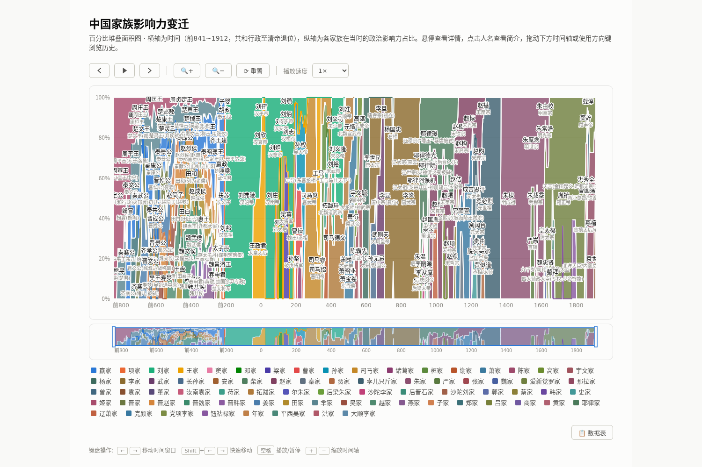

# 中国家族影响力变迁

> A percentage-stacked area chart visualizing the rise and fall of 73 prominent families across Chinese history, from 770 BCE to 1912 CE.

从春秋（前 770 年）到清亡（1912 年），**73 个家族、409 位人物**的影响力变迁百分比堆叠面积图。单文件 HTML，无构建步骤，浏览器直接打开即可。



## 功能特性

- **百分比堆叠面积图**：横轴为年份，纵轴为各家族影响力占比，直观呈现朝代更替与权力结构演变
- **时间视口**：±40 年平移、缩放、brush 拖选区间，视口自动钳制在数据范围内（-770 ~ 1912），不会露出空白
- **播放**：0.25× / 0.5× / 1× / 2× / 4× 五档速度，推进到右边界自动回绕
- **人物详情**：点击人名弹出 bio 弹窗（含在位年份、关键事件与史料口径说明）
- **数据表**：全量人物一览（家族 / 姓名 / 称号 / 起止年份 / 影响力）
- **深浅色主题**：一键切换；74 个固定色槽保证家族颜色在主题切换与数据增补后始终稳定
- **移动端触控**：单指水平拖动平移、双指捏合缩放（以两指中点年份为锚）、轻点人名弹详情
- **同族断代衔接**：同一家族世代间断以发丝线桥接（gapBridge），跨家族 / 跨朝代空窗保持留白

## 数据口径

- `start` / `end` 为**实际掌权年份**（非生卒年）：帝王通常为即位至去世 / 退位，权臣为实际执政区间
- `influence ∈ [5, 90]`：人物在世期间的实际权力主观评估（非身后名声）
- 家族按**权力实体**划分，同名不同族严格区分：如「晋赵家 / 晋魏家 / 晋韩家」分立，「辽萧家」（契丹述律氏）≠「萧家」（沛县萧何一族），「沙陀李家」≠「李家」（唐皇室）
- 覆盖前 770 ~ 1912 年，**无空窗年**（任意年份至少一个家族在带）
- 史料以《二十四史》等正史为准，争议处从通说，特殊口径在人物 bio 中注明

## 使用方法

无需构建，直接打开 `chinese-families-chart.html`（需联网加载 D3 CDN）。或起本地服务：

```bash
python3 -m http.server 8000
# 浏览器访问 http://127.0.0.1:8000/chinese-families-chart.html
```

## 技术说明

- **单文件架构**：HTML + CSS + JS 内联，唯一外部依赖为 [D3.js v7](https://d3js.org)（CDN）
- **渲染管线**：`rawData` → 家族聚合 → `stackOrder` 排序 → `splitBridgeSegments` / `gapBridge` 分段 → SVG path
- **颜色机制**：`SLOTS` 固定色槽数组（74 槽，深浅主题各一套色值），家族按加入顺序绑定色槽，后续数据增补不影响既有家族颜色
- `package.json` 中的 puppeteer 仅为开发期截图自查使用，非运行时依赖

## License

[Apache License 2.0](LICENSE)
